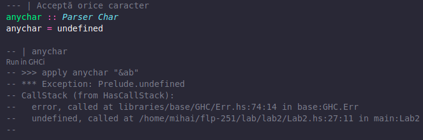

# Laborator 2 (Parser Combinators)

Fișierele `Lab2.hs`, `Test.hs`, respectiv `lab2.pdf` sunt generate automat din fișierul `lab2.md`. Puteți consulta `Makefile`-ul pentru detalii. 

Fișierul `Lab2.hs` conține teste în comentarii. Dacă folosiți VSCode, puteți rula individual aceste teste în `ghci` direct în fișier. 

Fiindcă această facilitate suprascrie secțiunea de output a testelor, testele există separat și în fișierul `Test.hs`. Puteți rula toate testele din `Test.hs` cu comanda `make test`.

**Atenție!**: Dacă alegeți din vreun motiv să rulați vreuna din comenzile care generează fișiere, riscați să suprascrieți fișierul în care lucrați.
